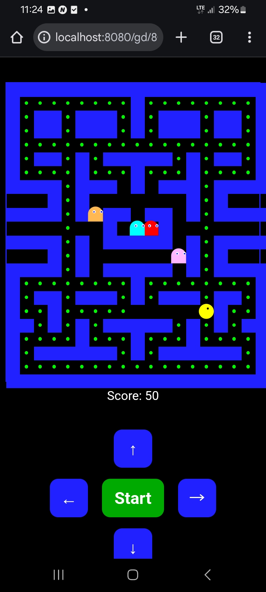

# Pacman

Plain js pacman made by AI

## First version

First version made in about an hour with AI. From a small [conversation](ai_initial.md) the AI made pretty large [code](controller.js).

Possible improvements: see [tasks](tasks.md)

Controls

- Arrow keys and space
- or onscrean btns for use on smartpones

LICENSE
----------------------------------------------------------

Copyright (C) Walter A. Jablonowski 2025, free under the [MIT license](LICENSE)

[Privacy](https://walter-a-jablonowski.github.io/privacy.html) | [Legal](https://walter-a-jablonowski.github.io/imprint.html)
